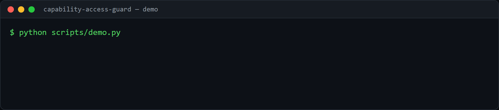

# capability-access-guard

[](https://github.com/SamirDiegoChavezCaceres/capability-access-guard/actions/workflows/ci.yml)  

A small authorization guard built on one rule: **fail closed.** Nothing is
allowed unless a capability explicitly grants it, and anything the engine is
unsure about - a missing context, an unknown capability, a resource owned by
another tenant - is a denial, not a silent pass.

## Demo



Generate it with [VHS](https://github.com/charmbracelet/vhs): `vhs demo.tape`.

## Why it looks like this

- **Capabilities, not roles.** Permissions are dotted namespaces
  (`knowledge.read.marketing`, `campaign.write`). Grants can be exact or a
  prefix wildcard (`knowledge.read.*`), so a capability can be widened without
  re-wiring call sites.
- **Deny by default.** The engine returns an allow decision only when a grant
  matches; every other path returns a denial.
- **Machine-readable reasons.** Each `PolicyDecision` carries a `reason_code`
  (`capability_not_granted`, `cross_tenant_resource`, `missing_context`, ...),
  so callers log and branch on the code, never on a message string.
- **Tenant isolation.** A non-internal actor may only touch resources owned by a
  group they belong to. Internal actors cross tenants but still need the
  capability.
- **Fail-closed parsing.** `context_from_mapping` turns untrusted input into a
  context and raises on anything malformed rather than building a permissive one.

## Use it

```python
from access_guard import new_context, require_capability, require_resource, ResourceRef, AccessDenied

ctx = new_context("agent-7", group_ids=["team-a"], capabilities=["knowledge.read.*", "campaign.read"])

require_capability(ctx, "knowledge.read.marketing")     # ok
require_resource(ctx, "campaign.read", ResourceRef("campaign", "team-a", "42"))  # ok

try:
    require_resource(ctx, "campaign.read", ResourceRef("campaign", "team-b", "99"))
except AccessDenied as e:
    print(e.decision.reason_code)   # 'cross_tenant_resource'
```

```bash
python scripts/demo.py
```

## Tests

```bash
pip install -e ".[dev]"
pytest
```

Covers exact and wildcard grants, deny-by-default, tenant isolation (including
the internal bypass), and fail-closed context parsing.

## Limitations and next steps

- Grants are flat strings with prefix wildcards; there is no role inheritance or
  attribute-based condition yet.
- Decisions are returned, not logged; a real system records every allow and deny
  for audit.
- Next: add an audit sink and time-bound grants.

## License

MIT.
